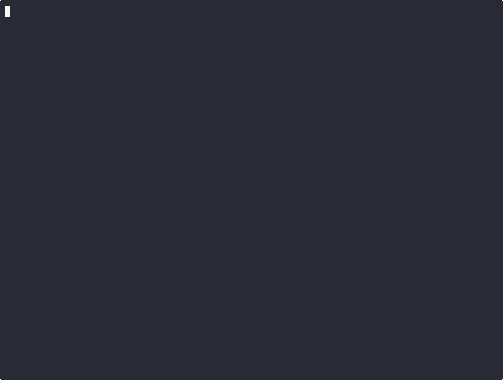

# OSBuilder

> Build end-to-end apps from a plain-English description. PM → Architect →
> Frontend → Backend → DevOps → QA → Reviewer → Tech Writer, all running
> sequentially over your existing Claude Code skill ecosystem (gsd, brainiac,
> predator, code-tester, problem-solver). Ships to a private GitHub repo.

OSBuilder is a Claude Code skill. You describe what you want; OSBuilder runs
a virtual studio sequentially (never parallel — multi-agent is an explicit
anti-feature) and delivers a working, version-controlled app.

## Quick Install (one-liner)

```bash
curl -fsSL https://raw.githubusercontent.com/cdlee/osbuilder/main/install.sh | sh
```

Replaces nothing existing on your machine. Drops `~/.claude/skills/osbuilder/`
in place and you're ready to run `/osbuilder` in any Claude Code session.

## Audited Install (read-the-script-first)

For users whose security policy disallows `curl ... | sh`:

```bash
git clone https://github.com/cdlee/osbuilder.git ~/osbuilder-src
cd ~/osbuilder-src && ./install.sh
```

Same destination (`~/.claude/skills/osbuilder/`); same idempotent installer.

## How OSBuilder Works (the dev-team metaphor)

OSBuilder narrates progress as a virtual studio. Each "role" is a sequential
delegation to your existing skill ecosystem — never parallel, never multi-agent.

| Stage | Role | What you'll see in the terminal | Delegates to |
|-------|------|----------------------------------|--------------|
| 1. Intake | **PM** | `PM is gathering requirements... ✓` | `/gsd:spec-phase` |
| 2. Research | **Architect** | `Architect chose Next.js because…` | `/brainiac` + `references/stack-menu.md` |
| 3. Scaffold | **DevOps** | `DevOps is setting up Docker Compose…` | `scripts/scaffold_dispatch.py` |
| 4. Plan | **Architect** | `Architect is planning phase 1…` | `/gsd:new-project --auto` + `/gsd:plan-phase` |
| 5. Build | **Frontend / Backend / DevOps** | `Frontend dev is building the homepage…` | `/gsd:execute-phase` |
| 6. Verify | **QA + Reviewer** | `QA is running adversarial tests…` / `Reviewer is checking architecture…` | `/code-tester` + `/gsd:verify-work` + `/predator` + `/gsd:code-review` |
| 7. Heal | **Debug-cap** (silent unless broken) | `Hit retry cap on validation; escalating to /problem-solver…` | `/gsd:debug` + `/problem-solver` |
| 8. Ship | **DevOps** | `DevOps is pushing to GitHub…` | `gh repo create --private` |

The 8th narration role — **Tech Writer** — runs as part of stage 8 alongside
DevOps, humanizing the auto-generated README and clone-and-run runbook before
the repo is pushed (`/gsd:docs-update` + `/humanizer`).

Every line you see in the terminal is plain English. Tutor mode (default)
explains *what just happened* after each stage — disable with `--quiet`.

## 60-Second Demo



Higher-quality version on asciinema:
[`assets/demo/osbuilder-demo.cast`](assets/demo/osbuilder-demo.cast) — replay
locally with `asciinema play assets/demo/osbuilder-demo.cast`.

> **Honest demo policy.** Recording is unedited end-to-end (paragraph →
> derived spec → scaffold → verify → private GitHub URL) per the contract in
> [`assets/demo/RECORDING-CHECKLIST.md`](assets/demo/RECORDING-CHECKLIST.md).
> No cuts that hide friction. If the demo asset isn't present yet, the
> checklist is the source of truth for how it gets recorded.

## What you get

- **Plain-English intake.** Describe an app in a paragraph; OSBuilder asks a
  few outcome-framed questions ("Should it work on phones too?") with an
  "I don't know, you decide" option that resolves to a sensible default.
- **Auto-installed prereqs.** First run detects missing Node, Python, git,
  `gh`, and Docker; offers a single-confirmation auto-install.
- **Deterministic scaffolders.** Always uses `create-next-app`, `cargo new`,
  etc. — never hand-writes `package.json` or `pyproject.toml` (avoids
  bolt.new's documented 10M-token spaghetti failure mode).
- **Slopsquatting gate.** Every package install is verified against the
  public registry before any code runs (`--ignore-scripts` until verified).
- **Private by default.** Repos created `gh repo create --private`; pass
  `--public` to override.
- **Self-healing.** 4-class failure classifier with documented retry
  strategies and a hard 3-reflection cap before structured handoff to you.

## Modes

| Flag | Effect |
|------|--------|
| (default) | Beginner mode — plain-English questioning, tutor narration on, sensible defaults |
| `--advanced` | Exposes stack choice, deploy targets, scaffolder selection |
| `--quiet` | Disables tutor mode (still narrates dev-team progress) |
| `--no-docker` | SQLite-only single-user builds (for users without Docker Desktop) |
| `--public` | Push to a public GitHub repo (default is private) |
| `--production-ready` | Adds named ROADMAP phases for hardening (see below) |

## --production-ready

Passes a flag that adds these as **named ROADMAP phases** (not default
scaffold code). Phase 6 implements this; the flag is wired end-to-end
through `intake_handler.py` → `state_writer.py` → `gsd_driver.py` step 3 →
`production_phase_writer.py` (which emits the slash commands below).

The 7 named upgrades:

- `observability` — logs/metrics/traces via OpenTelemetry
- `migrations` — automated migrations via Drizzle Kit / Alembic
- `healthchecks` — `/healthz` endpoints
- `secret-manager` — secret manager integration
- `sentry` — Sentry error tracking
- `rate-limiting` — rate limiting middleware
- `backups` — backup strategy

Default mode emits zero of these; the flag turns each into a
`/gsd-add-phase <name>` command appended to your project's ROADMAP.

## Examples

See [`examples/`](examples/README.md) for real apps OSBuilder built end-to-end
— each with the original paragraph spec, screenshots, and a link to the
resulting GitHub repo (or `NOT_PUBLISHED` placeholder for local-only builds).

The current gallery covers 3 distinct playbooks: web, cli, and ai-service.

## Sub-skill version requirements

OSBuilder declares minimum versions for its sub-skills in SKILL.md
frontmatter (see [`references/version-policy.md`](references/version-policy.md)).
On first invocation each session, `scripts/check_skill_versions.py` validates
that GSD, brainiac, predator, code-tester, and problem-solver meet those
minimums. Drift = friendly upgrade command and refusal to proceed.

To force a re-check after upgrading a sub-skill mid-session:

```bash
rm -f ~/.osbuilder/last_check.txt
```

## Project status

Built phase-by-phase via [GSD](https://github.com/gsd-skill/gsd) itself.
See [`.planning/ROADMAP.md`](.planning/ROADMAP.md) for shipped phases and
next milestones. Currently delivering Phase 8: Skill quality / publish-bar.

## License

See LICENSE in the repo root.

## See also

- [`SKILL.md`](SKILL.md) — entry point + routing (≤ 200 lines, enforced by CI)
- [`references/`](references/) — playbooks, role briefs, refusal list, version policy
- [`.planning/`](.planning/) — full GSD planning history
- [`examples/`](examples/README.md) — reference builds gallery
